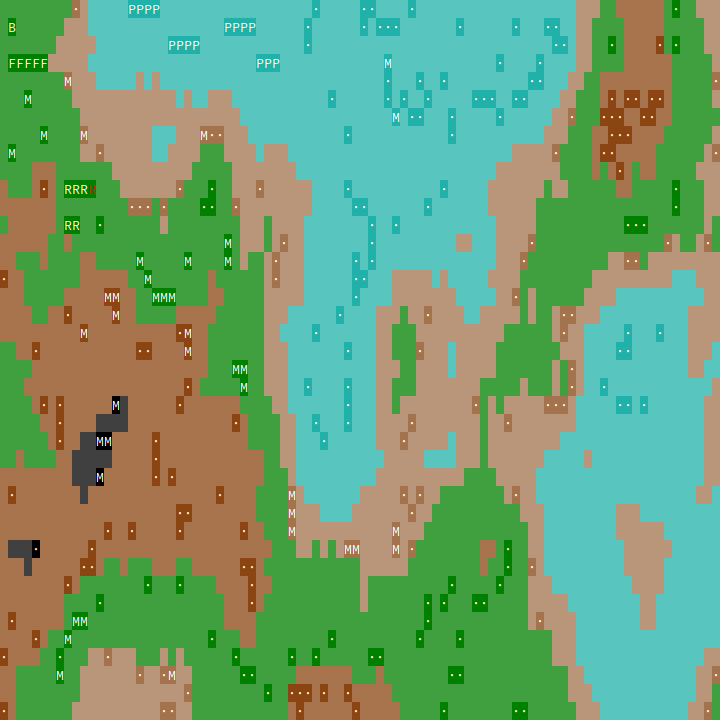
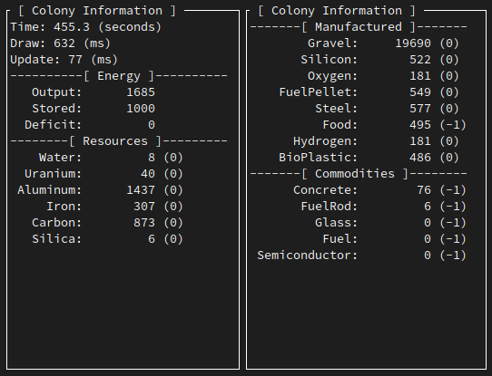
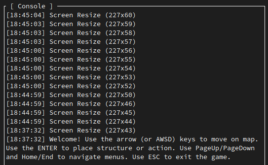
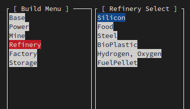

# Exo Colony
A real-time simulation game about building a colony on an exo-planet for terminal lovers.

Inspired by Dwarf Fortress: the build cursor and the camera are two different things.

## Run

```
cargo run --release --bin exocolony
cargo run --release --bin exocolony -- --seed foothold
exocolony --help
```

`--seed` / `-s` fixes world generation. Omit it and a random 8-character seed is chosen and shown in the console and map title.

## Controls

| Input                                       | Action                                           |
|---------------------------------------------|--------------------------------------------------|
| Arrows / WASD                               | Move the build cursor                            |
| Alt+Arrows / Alt+WASD                       | Pan the camera (turns follow off)                |
| F4                                          | Toggle camera-follow-cursor                      |
| F3                                          | Pin home at the cursor                           |
| Home                                        | Return cursor and camera to the pinned home      |
| Tab / Shift+Tab, `[` `]`, PageUp / PageDown | Cycle build menu groups                          |
| `;` `'` (also Tab / `[` `]`)                | Cycle build menu groups                          |
| `-` `=` / `,` `.` / End                     | Cycle structure variants                         |
| PageUp / PageDown                           | Scroll the console log                           |
| Enter                                       | Place structure (then it builds for a few ticks) |
| Delete                                      | Remove structure on the cursor tile              |
| `?`                                         | Reprint controls in the console                  |
| Esc                                         | Quit                                             |

The console keeps the last **256** lines, oldest first and newest at the bottom. While you are pinned to the tail, new messages keep the view following. Page Up looks back; Page Down returns to the tail and resumes follow.

The first Base you place is pinned as home automatically if none is set.

On the map, lowercase structure glyphs are still under construction. Bright glyphs are active this tick; dark glyphs are idle.

## Screenshots

### Map with resources and built structures



### Colony information widgets



### Console / Log



### Build menu with structures and variants



## Alpha Roadmap
This game is currently in the *alpha* stage.
We will move to *beta* once all game mechanics are implemented.

### Implemented

* Rendering loop
* Interface layouts
* Dynamic map and height map (perlin noise)
* Structure placement
* Energy management and requirements
* Resource management and requirements
* Commodity management and requirements
* Structure components
* Tile info panel
* Structure building placement restrictions
* 256×256 world with a camera viewport sized to the map widget (0.3)
* Independent camera (Alt+Arrows) and cursor (0.3)
* F4 camera-follow-cursor (0.3)
* `--seed` world generation (0.3)
* Pinned home: F3 pin, Home return; first Base auto-pins (0.3)
* Thin construction delay before a structure operates (0.3)
* Building activity shown on the map glyph and info panel (0.3)
* Build menu on `;` / `'` (0.3)
* Log: PageUp/PageDown scroll, 256-line buffer, follow-tail (0.3)

### 0.3.1 — Camera polish

* Edge slack while following (do not re-center until the cursor hits a margin)
* Optional page-pan (Alt+Shift or held Alt jumps half a view)
* Jump-to-next-structure / cycle bases
* Minimap or compass tick in the map chrome
* Faster startup: generate deposits only where noise marks a resource, skip full-cache clone

### 0.4 — Economy and the spaceport

* ExoCoin wallet and running costs
* Spaceport structure group (export commodities, import rare goods)
* Construction that consumes stockpiled resources instead of a fixed tick delay
* Cancel construction / refund
* Persist seed and colony to a save file

### Later alpha

* Building activity that drains local deposits (`available` on tiles)
* Power / logistics radius so a 256² map has local grids
* Fog of exploration

## Beta Roadmap
...
