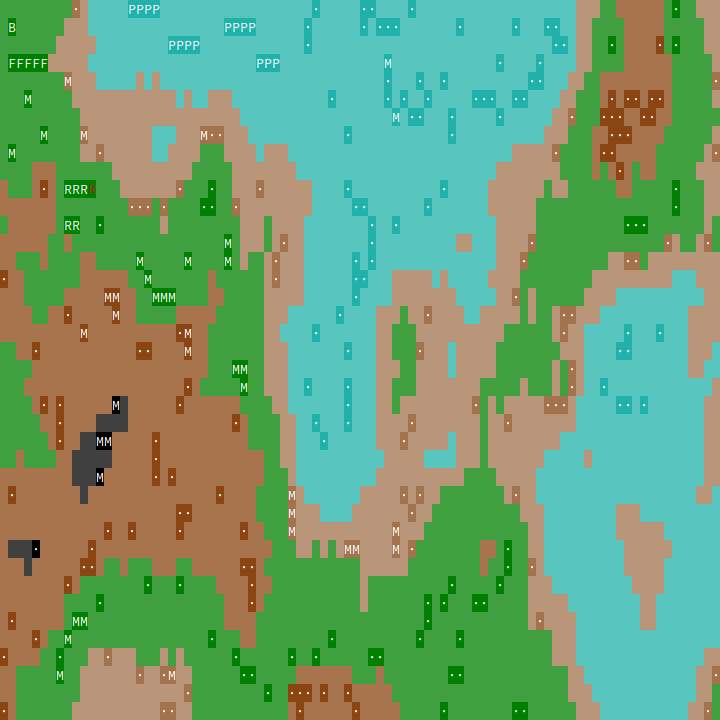
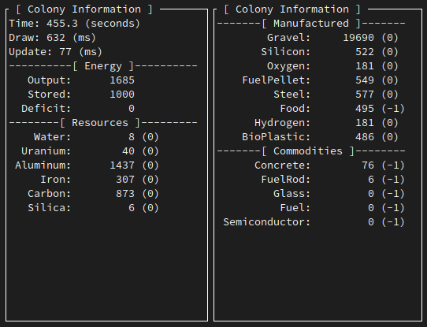
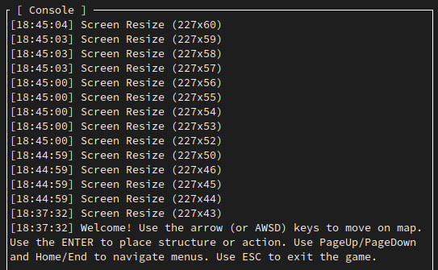
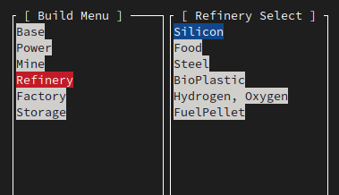

# Exo Colony
A real-time simulation game about building a colony on an exoplanet for terminal lovers.

Inspired by Dwarf Fortress: the build cursor and the camera are two different things.

## Run

```
cargo run --release --bin exocolony
cargo run --release --bin exocolony -- --seed foothold
exocolony --help
```

`--seed` / `-s` fixes world generation. Omit it, and a random 8-character seed
is chosen and shown in the console and map title.

## Controls

| Input                                       | Action                                           |
|---------------------------------------------|--------------------------------------------------|
| Arrows / WASD                               | Move the build cursor                            |
| Alt+Arrows / Alt+WASD                       | Pan the camera (turns follow off)                |
| Alt+Shift+Arrows / Alt+Shift+WASD           | Page-pan half a view (turns follow off)          |
| F4                                          | Toggle camera-follow-cursor (edge slack)         |
| F3                                          | Pin home at the cursor                           |
| Home                                        | Return cursor and camera to the pinned home      |
| `n` / `N`                                   | Next / previous structure (camera follows jump)  |
| `b` / `B`                                   | Next / previous Base                             |
| Tab / Shift+Tab, `[` `]`, PageUp / PageDown | Cycle build menu groups                          |
| `;` `'` (also Tab / `[` `]`)                | Cycle build menu groups                          |
| `-` `=` / `,` `.` / End                     | Cycle structure variants                         |
| PageUp / PageDown                           | Scroll the console log                           |
| Enter                                       | Place structure (then it builds for a few ticks) |
| Delete                                      | Remove structure on the cursor tile              |
| `?`                                         | Reprint controls in the console                  |
| Esc                                         | Quit                                             |

## Screenshots

### Map with resources and built structures



### Colony information widgets



### Console / Log



### Build menu with structures and variants



## Alpha Roadmap
This game is currently in the *alpha* stage.
We will move to *beta* once all game mechanics are implemented.

### 0.4 — Economy and the spaceport

* ExoCoin wallet and running costs
* Spaceport structure group (export commodities, import rare goods)
* Construction that consumes stockpiled resources (tick delay still applies)
* Cancel construction / refund
* Persist seed and colony to a save file

### Later alpha

* Building activity that drains local deposits (`available` on tiles) — mines (0.3.1)
* Power / logistics radius so a 256² map has local grids
* Fog of exploration

## Beta Roadmap
...
